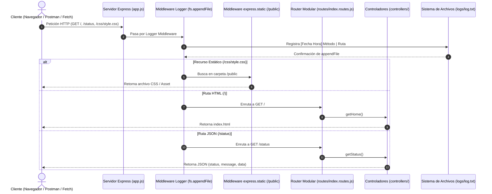

# TP Integrador JS - Módulo 6: Primeros pasos con Node y Express
> **Evaluación de los Módulos #6, #7 y #8**  
> **Unidad solicitante:** Departamento de Desarrollo Backend  
> **Autor:** Sebastian  
> **Stack:** Node.js, Express.js, Dotenv, Nodemon, fs  

---

## 📌 1. Descripción del Proyecto

Este proyecto constituye la **Parte 1 (Módulo 6)** del desarrollo backend de una aplicación web para la gestión de usuarios y datos. En esta etapa se establecen los cimientos arquitectónicos de la aplicación:
- Servidor web robusto con **Express.js**.
- Estructura desacoplada y modular dividida en **5 capas** (`routes/`, `controllers/`, `middlewares/`, `public/`, `logs/`).
- Servido de contenido estático (HTML/CSS) mediante `express.static()`.
- Exposición de endpoints públicos con respuestas tanto en **HTML** como en **JSON** con formato consistente (`status`, `message`, `data`).
- Persistencia simple en archivos planos mediante el módulo nativo `fs` (`fs.appendFile`) para registrar cada acceso al servidor en `logs/log.txt`.

---

## 🔄 2. Esquema del Flujo Servidor – Cliente



---

## 💻 3. Requisitos del Sistema

- **Node.js:** Versión 18.x o superior (LTS recomendada). Compatible también con Node.js 16+.
- **npm:** Versión 8.x o superior.
- **Sistema Operativo:** Windows, macOS o Linux.
- **Herramienta opcional para pruebas:** Navegador Web, Postman, Thunder Client o cURL.

---

## 🛠️ 4. Instrucciones de Instalación y Puesta en Marcha

### 4.1. Clonar el repositorio
```bash
git clone https://github.com/SebastianSanchez2023/Proyecto-Node-Express-Web-App.git
cd tp-modulo-6-express
```

### 4.2. Instalar dependencias
```bash
npm install
```

### 4.3. Configuración de Variables de Entorno
Crea o copia el archivo de variables de entorno:
```bash
# En Windows (PowerShell):
Copy-Item .env.example .env

# En Linux/macOS:
cp .env.example .env
```
Contenido predeterminado de `.env`:
```env
PORT=3001
NODE_ENV=development
```
*(Nota: Si el puerto 3000 estuviera en uso por otro proceso del sistema, puedes asignar `PORT=3001` o cualquier otro puerto disponible).*

### 4.4. Ejecución del Servidor

- **Modo Producción / Inicio Estándar:**
  ```bash
  npm start
  ```
- **Modo Desarrollo (con recarga automática mediante Nodemon):**
  ```bash
  npm run dev
  ```

Al arrancar, la terminal imprimirá:
```text
Servidor iniciado
[OK] Servidor escuchando en: http://localhost:3001
[INFO] Modo de ejecución: development
```

---

## 🌐 5. Endpoints y Rutas Disponibles

| Método | Ruta | Tipo de Respuesta | Descripción |
| :--- | :--- | :--- | :--- |
| `GET` | `/` | `HTML` | Sirve la página web principal desde `/public/index.html`. |
| `GET` | `/status` | `JSON` | Retorna el estado de salud, uptime del servidor, versión de Node y entorno. |
| `GET` | `/logs` | `JSON` | Permite consultar en formato JSON las líneas persistidas en `logs/log.txt`. |
| `GET` | `/css/style.css` | `CSS` | Recurso estático servido por `express.static()`. |

### Ejemplo de respuesta `/status` (JSON consistente):
```json
{
  "status": "success",
  "message": "Servidor operativo y respondiendo correctamente",
  "data": {
    "uptime": "120 segundos",
    "timestamp": "2026-09-27T06:53:24.012Z",
    "environment": "development",
    "nodeVersion": "v16.17.0",
    "platform": "win32",
    "author": "Sebastian",
    "module": "Módulo 6 - Primeros pasos con Node y Express"
  }
}
```

---

## 📁 6. Persistencia en Archivos Planos (`logs/log.txt`)

Cada solicitud entrante pasa por el middleware `middlewares/logger.middleware.js`, el cual registra de manera no bloqueante (`fs.appendFile`) una línea con el siguiente formato:

```text
[YYYY-MM-DD HH:mm:ss] Método: GET | Ruta: /status
```

### Contenido generado de ejemplo (`logs/log.txt`):
```text
# Archivo de registro de actividad de rutas (log.txt)
# Persistencia en archivos planos implementada con fs.appendFile
[2026-09-27 03:53:23] Método: GET | Ruta: /
[2026-09-27 03:53:24] Método: GET | Ruta: /status
[2026-09-27 03:53:24] Método: GET | Ruta: /logs
```

---

## 🧠 7. Justificaciones Técnicas y Decisiones de Diseño

### 7.1. Nombre del archivo principal (`app.js` vs `index.js`)
Se eligió **`app.js`** como nombre base del archivo principal debido a que representa explícitamente la instancia de la aplicación web y la configuración del servidor Express. En arquitecturas modernas de Node.js, `app.js` suele contener la configuración de middlewares, montaje de rutas y arranque del servidor, dejando abierta la posibilidad a futuro de desacoplar el servidor HTTP (`server.js` o `index.js` como punto de entrada de arranque) de la lógica de configuración (`app.js`), facilitando testing unitario y de integración (con herramientas como Supertest).

### 7.2. Elección de los Scripts en `package.json`
- **`npm start` (`node app.js`):** Script estándar en el ecosistema Node.js y plataformas en la nube (Heroku, Render, AWS, Docker). No incluye herramientas de desarrollo pesado para garantizar bajo consumo de recursos en entornos productivos.
- **`npm run dev` (`nodemon app.js`):** Script esencial para la experiencia de desarrollo (DX). Observa cambios en el código fuente y reinicia el servidor automáticamente sin intervención manual.

### 7.3. Uso de la carpeta `/public` y `express.static()`
Se implementó `express.static()` apuntando a la carpeta `/public` porque permite servir recursos front-end (hojas de estilo CSS, scripts del cliente, imágenes y documentos estáticos) de manera eficiente y nativa, sin necesidad de sobrecargar los controladores con la lectura manual de archivos.

### 7.4. Justificación de la Arquitectura Modular (5 carpetas)
Para cumplir y superar los criterios de evaluación, el proyecto fue dividido en 5 capas especializadas:
1. **`routes/`**: Desacopla la definición de endpoints del archivo principal utilizando `express.Router()`.
2. **`controllers/`**: Centraliza la lógica de negocio y la construcción de respuestas (`status`, `message`, `data`), manteniendo las rutas limpias.
3. **`middlewares/`**: Funciones intermedias reutilizables (ej. registro en `fs.appendFile` y manejo global de errores).
4. **`public/`**: Almacena activos estáticos y vistas accesibles públicamente.
5. **`logs/`**: Aísla la persistencia de datos en archivos planos, separando los datos persistidos del código fuente.

Esta estructura modular garantiza que cuando se incorporen bases de datos y ORMs en los **Módulos #7 y #8**, la aplicación pueda escalar incorporando carpetas complementarias (`models/`, `services/`, `config/`) sin alterar la lógica existente.

---

## 📦 8. Estructura de Carpetas

```text
tp-modulo-6-express/
├── controllers/
│   ├── home.controller.js
│   └── system.controller.js
├── logs/
│   └── log.txt
├── middlewares/
│   └── logger.middleware.js
├── node_modules/
├── public/
│   ├── css/
│   │   └── style.css
│   └── index.html
├── routes/
│   └── index.routes.js
├── .env
├── .env.example
├── .gitignore
├── app.js
├── package.json
└── README.md
```

---
