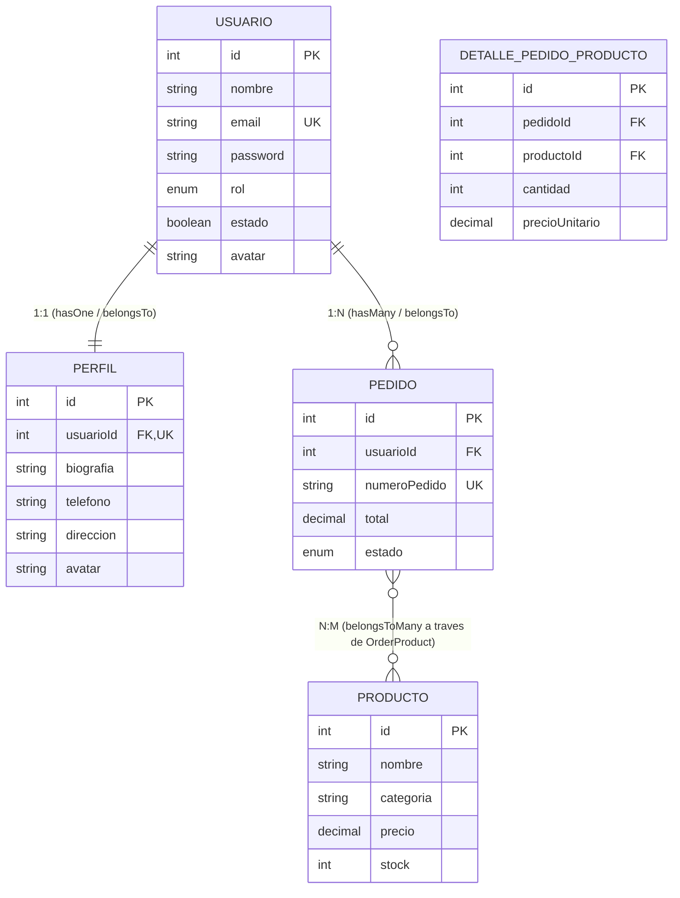

# Proyecto Integrador: Node & Express Web App (Módulos 6, 7 & 8)
> **Evaluación Integral de los Módulos #6, #7 y #8**  
> **Unidad solicitante:** Departamento de Desarrollo Backend  
> **Autor:** Sebastián Sánchez  
> **Stack:** Node.js (v18+), Express.js, MySQL 8.0, Sequelize ORM, JSON Web Tokens (JWT), Bcrypt.js, Multer, Swagger UI (OpenAPI 3.0), Dotenv, Nodemon, FS  
> **Repositorio Oficial:** [https://github.com/SebastianSanchez2023/Proyecto-Node-Express-Web-App](https://github.com/SebastianSanchez2023/Proyecto-Node-Express-Web-App)  

---

## 📌 1. Descripción General del Proyecto

Este repositorio contiene la solución técnica integral y modular desarrollada a lo largo de las tres etapas formativas del programa de backend:

1. **Módulo 6 (Estructura Base del Servidor & Archivos Planos):**
   - Servidor HTTP con Express.js.
   - Arquitectura modular desacoplada (`controllers/`, `routes/`, `middlewares/`, `services/`).
   - Servido estático de contenido web desde `/public`.
   - Persistencia en archivos planos para auditoría de tráfico (`logs/log.txt`).
2. **Módulo 7 (Acceso a Datos Relacionales & ORM Sequelize):**
   - Conexión al motor de base de datos **MySQL 8.0** mediante pool optimizado.
   - Modelado de esquemas con **Sequelize ORM**, validadores declarativos y scopes automáticos de exclusión de datos sensibles (`password`).
   - Operaciones **CRUD completas** con filtros de consulta dinámicos y paginación.
   - **Transaccionalidad atómica (ACID)** con rollback garantizado y auditoría de fallos en `logs/transactions_errors.log`.
   - Modelado de relaciones **1:N** con Eager Loading (`include`).
3. **Módulo 8 (API RESTful Segura, JWT, Multer & Documentación OpenAPI):**
   - Exposición de una **API RESTful estandarizada** `{ status, message, data }` para consumo de clientes externos.
   - **Autenticación criptográfica con JWT (JSON Web Tokens)** y contraseñas cifradas unidireccionalmente con **Bcrypt.js** (10 salt rounds).
   - Middleware de protección de rutas privadas `verifyJWT` y control de acceso basado en roles `authorizeRole` (RBAC).
   - **Subida de archivos con Multer** en `/uploads`, con validación estricta de extensiones seguras (MIME types: JPG, PNG, WEBP, PDF) y límite de 5 MB.
   - **Tarea PLUS:** Asociación directa del archivo subido con el registro de base de datos (`User.avatar` y `Profile.avatar`).
   - **Modelado relacional ampliado:** Cobertura de relaciones **1:1** (`User` &harr; `Profile`), **1:N** (`User` &harr; `Order`) y **N:M** (`Order` &harr; `Product` a través de `OrderProduct`).
   - **Tarea PLUS:** Documentación viva interactiva mediante **Swagger UI / OpenAPI 3.0** en `/api-docs`.
   - Colección completa de pruebas para **Postman** (`postman/`).

---

## 🏗️ 2. Arquitectura del Proyecto

```
tp-modulo-6-express/
│
├── config/
│   ├── db.config.js               # Conexión al motor MySQL y pool de Sequelize
│   ├── multer.config.js           # Almacenamiento en disco, filtros y límites de Multer
│   └── swagger.config.js          # Especificación OpenAPI 3.0 y montaje de Swagger UI
│
├── controllers/
│   ├── auth.controller.js         # Controlador de login, register y perfil JWT
│   ├── home.controller.js         # Controlador de presentación web estática
│   ├── order.controller.js        # Controlador de pedidos y catálogo N:M
│   ├── system.controller.js       # Controlador de estado (/status) y logs (/logs)
│   ├── upload.controller.js       # Controlador de subida de archivos y avatar a BD
│   └── user.controller.js         # Controlador de usuarios y comparativa ORM
│
├── middlewares/
│   ├── auth.middleware.js         # Validación de token JWT (verifyJWT) y roles (authorizeRole)
│   └── logger.middleware.js       # Registro no bloqueante de peticiones en logs/log.txt
│
├── models/
│   ├── index.js                   # Inicialización, asociaciones 1:1, 1:N, N:M y semillas
│   ├── order.model.js             # Entidad Pedido (Order)
│   ├── orderProduct.model.js      # Tabla pivote intermedia para relación N:M
│   ├── product.model.js           # Entidad Producto (Product)
│   ├── profile.model.js           # Entidad Perfil 1:1 (Profile)
│   └── user.model.js              # Entidad Usuario con hooks Bcrypt y scopes
│
├── routes/
│   ├── auth.routes.js             # Rutas /api/auth (register, login, perfil protegido)
│   ├── index.routes.js            # Enrutador central con montaje de sub-rutas
│   ├── order.routes.js            # Rutas /api/pedidos (CRUD y protección JWT)
│   ├── upload.routes.js           # Rutas /api/upload (Multer y avatar protegido)
│   └── user.routes.js             # Rutas /api/usuarios (CRUD, relaciones y avatar)
│
├── services/
│   ├── audit.service.js           # Persistencia en archivos planos (auth, uploads, tx)
│   ├── auth.service.js            # Lógica de login, register y generación de JWT
│   ├── order.service.js           # Lógica de negocio y transacciones de pedidos N:M
│   └── user.service.js            # Lógica de usuarios, transacciones ACID y ORM
│
├── utils/
│   └── jwt.util.js                # Funciones criptográficas generateToken y verifyToken
│
├── public/
│   ├── css/style.css              # Estilos modernos (Dark Mode, Glassmorphism, Tabs)
│   ├── js/app.js                  # Frontend interactivo para pruebas de JWT, Multer y ORM
│   └── index.html                 # Dashboard SPA servido estáticamente
│
├── uploads/                       # Directorio de almacenamiento de archivos públicos
├── logs/                          # Archivos planos: log.txt, auth_audit.log, uploads.log
├── postman/                       # Colección y Entorno listos para importar en Postman
├── test-endpoints.js              # Batería automatizada de pruebas HTTP
├── REFLEXIONES_TECNICAS_MODULO_7.md # Documento de decisiones técnicas del Módulo 7
├── REFLEXIONES_TECNICAS_MODULO_8.md # Documento de justificación y decisiones del Módulo 8
├── app.js                         # Punto de entrada de la aplicación Express
├── package.json                   # Dependencias y scripts de ejecución
└── .env.example                   # Plantilla de variables de entorno
```

---

## 🗄️ 3. Diagrama Entidad-Relación del ORM (1:1, 1:N y N:M)



---

## 🚀 4. Instalación y Puesta en Marcha

### Requisitos Previos
- **Node.js** v18 o superior (compatible con v16+).
- **MySQL 8.0** instalado y en ejecución.

### Pasos de Configuración:
1. **Clonar el repositorio:**
   ```bash
   git clone https://github.com/SebastianSanchez2023/Proyecto-Node-Express-Web-App.git
   cd Proyecto-Node-Express-Web-App
   ```
2. **Instalar dependencias:**
   ```bash
   npm install
   ```
3. **Configurar el archivo `.env`:**
   Cree una copia de `.env.example` con el nombre `.env`:
   ```ini
   PORT=3001
   NODE_ENV=development

   # Base de Datos MySQL
   DB_HOST=localhost
   DB_PORT=3306
   DB_USER=root
   DB_PASSWORD=su_password
   DB_NAME=modulo7_db
   DB_DIALECT=mysql

   # Criptografía JWT (Módulo 8)
   JWT_SECRET=super_secreto_alkemy_jwt_token_key_2026_seguro
   JWT_EXPIRES_IN=2h
   ```
4. **Ejecutar el servidor:**
   - Modo desarrollo (recarga automática):
     ```bash
     npm run dev
     ```
   - Modo estándar:
     ```bash
     npm start
     ```
   *Al iniciar, Sequelize sincronizará automáticamente las tablas (`alter: true`) y poblará los datos iniciales de prueba (usuarios, perfiles, productos y pedidos).*

5. **Ejecutar la suite de pruebas automatizadas:**
   ```bash
   npm test
   ```
   *Verifica automáticamente el ciclo completo: autenticación, bloqueo 401 sin token, acceso 200 con JWT, relaciones ORM y creación de pedidos.*

---

## 🔐 5. Guía de Autenticación con JWT

### 5.1. Usuarios de Prueba Preconfigurados (Semillas)

| Rol | Correo Electrónico | Contraseña | Permisos |
| :--- | :--- | :--- | :--- |
| **Administrador** | `admin@alkemy.com` | `AdminPassword123!` | Acceso total, eliminación de usuarios (`DELETE`) y auditoría |
| **Cliente** | `lucia@example.com` | `ClientePassword123!` | Creación de pedidos, actualización de perfil propio y subida de avatar |
| **Operador** | `carlos@example.com` | `OperadorPassword123!` | Consulta de inventario y pedidos |

### 5.2. Flujo de Autenticación Paso a Paso

1. **Inicio de Sesión:** Envíe una petición `POST /api/auth/login`:
   ```bash
   curl -X POST http://localhost:3001/api/auth/login \
     -H "Content-Type: application/json" \
     -d '{"email": "admin@alkemy.com", "password": "AdminPassword123!"}'
   ```
   **Respuesta Exitosa (200 OK):**
   ```json
   {
     "status": "success",
     "message": "Autenticación exitosa. Token JWT generado correctamente.",
     "data": {
       "usuario": { "id": 1, "nombre": "Sebastián Sánchez", "rol": "admin" },
       "token": "eyJhbGciOiJIUzI1NiIsInR5cCI6IkpXVCJ9...",
       "tokenType": "Bearer"
     }
   }
   ```
2. **Consumo de Rutas Protegidas:** Incluya el token en la cabecera HTTP:
   ```http
   Authorization: Bearer <token_obtenido>
   ```
   Ejemplo de consulta a `/api/auth/perfil`:
   ```bash
   curl -X GET http://localhost:3001/api/auth/perfil \
     -H "Authorization: Bearer <token_obtenido>"
   ```
3. **Manejo de Respuestas de Seguridad:**
   - **Sin Token:** Retorna `HTTP 401 Unauthorized` con mensaje explicativo.
   - **Token Expirado:** Retorna `HTTP 401 Unauthorized` con código `TOKEN_EXPIRED`.
   - **Token Manipulado o Firma Errónea:** Retorna `HTTP 403 Forbidden` con código `TOKEN_INVALID`.

---

## 📋 6. Tabla de Endpoints de la API RESTful

| Método | Endpoint | Acceso | Descripción |
| :---: | :--- | :---: | :--- |
| **GET** | `/` | Público | Dashboard web interactivo con consola en vivo |
| **GET** | `/api-docs` | Público | **Swagger UI:** Documentación OpenAPI interactiva |
| **GET** | `/status` | Público | Diagnóstico de salud, uptime y runtime |
| **GET** | `/logs` | Público | Lectura de archivo plano `logs/log.txt` |
| **POST** | `/api/auth/register` | Público | Registro de usuario con perfil 1:1 inicializado |
| **POST** | `/api/auth/login` | Público | Inicio de sesión, validación Bcrypt y emisión de JWT |
| **GET** | `/api/auth/perfil` | **Privado (JWT)** | Consulta de perfil del usuario autenticado |
| **GET** | `/api/usuarios` | Público | Listar usuarios con paginación y filtros (`?nombre=`, `?rol=`) |
| **GET** | `/api/usuarios/:id` | Público | Detalle de usuario por ID con perfil y pedidos |
| **GET** | `/api/usuarios/relaciones` | Público | **Eager Loading completo: 1:1, 1:N y N:M** |
| **GET** | `/api/usuarios/comparativa-sql-orm` | Público | Benchmark comparativo: SQL manual vs Sequelize ORM |
| **POST** | `/api/usuarios/transaccion` | Público | Transacción ACID (Usuario + Pedido) con rollback |
| **PUT** | `/api/usuarios/:id` | **Privado (JWT)** | Modificación controlada de campos autorizados |
| **DELETE** | `/api/usuarios/:id` | **Privado (JWT Admin)** | Eliminación de usuario con borrado en cascada |
| **POST** | `/api/usuarios/:id/avatar` | **Privado (JWT)** | **Tarea PLUS:** Subir foto con Multer y asociarla a la BD |
| **POST** | `/api/upload` | Público | Subida genérica de archivo con validación de tipo y tamaño |
| **GET** | `/api/pedidos` | Público | Listado de pedidos con clientes y productos asociados |
| **GET** | `/api/pedidos/:id` | Público | Detalle de pedido con desglose de productos N:M |
| **POST** | `/api/pedidos` | **Privado (JWT)** | Crear pedido vinculando productos N:M |
| **PUT** | `/api/pedidos/:id/estado` | **Privado (JWT)** | Actualizar estado (`pendiente`, `pagado`, etc.) |

---

## 📁 7. Colección de Postman y Evidencias para Google Drive

Para facilitar la generación de capturas requeridas en la entrega:
1. Abra **Postman** e importe los dos archivos ubicados en la carpeta `/postman`:
   - `Alkemy_Modulo_8_API.postman_collection.json`
   - `Alkemy_Local.postman_environment.json`
2. Al ejecutar la petición `POST /api/auth/login`, el script de tests integrado **guarda automáticamente el token JWT** en las variables de la colección y del entorno.
3. Las peticiones privadas (`GET /api/auth/perfil`, `PUT /api/usuarios/1`, `POST /api/pedidos`) consumen directamente `{{token}}`, permitiendo tomar capturas de:
   - **Éxito:** Rutas protegidas respondiendo con `200 OK` / `201 Created`.
   - **Fallo 401:** Ruta protegida ejecutada sin enviar cabecera Authorization.
   - **Fallo 403:** Ruta protegida ejecutada con token corrupto o rol insuficiente.
   - **Subida de Archivos:** `POST /api/usuarios/1/avatar` con retorno de URL pública e impacto en MySQL.

---

## 📑 8. Documentos de Justificación Técnica y Reflexión

En cumplimiento estricto de las consignas de evaluación de Alkemy, se proporcionan dos monografías técnicas exhaustivas:
- [📄 REFLEXIONES_TECNICAS_MODULO_7.md](file:///C:/Users/Seba/.gemini/antigravity-ide/scratch/tp-modulo-6-express/REFLEXIONES_TECNICAS_MODULO_7.md): Decisiones sobre conexión MySQL, pooling, transacciones ACID y relaciones 1:N.
- [📄 REFLEXIONES_TECNICAS_MODULO_8.md](file:///C:/Users/Seba/.gemini/antigravity-ide/scratch/tp-modulo-6-express/REFLEXIONES_TECNICAS_MODULO_8.md): Justificación sobre separación de rutas/controladores, validaciones de entrada, políticas de seguridad JWT, almacenamiento de tokens, configuración de Multer y reflexión integradora de los 3 módulos.
