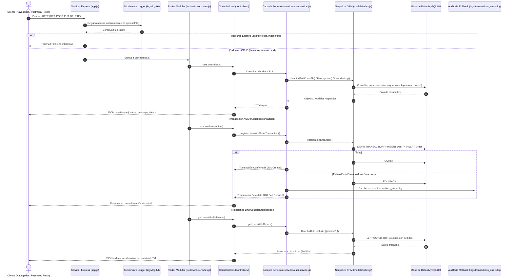

# TP Integrador JS - Módulos 6 y 7: Node, Express, MySQL & Sequelize ORM
> **Evaluación Integral de los Módulos #6, #7 y #8**  
> **Unidad solicitante:** Departamento de Desarrollo Backend  
> **Autor:** Sebastián Sánchez  
> **Stack:** Node.js, Express.js, MySQL 8.0, Sequelize ORM, Dotenv, Nodemon, fs  

---

## 📌 1. Descripción del Proyecto

Este repositorio contiene la implementación backend de una aplicación web escalable desarrollada en dos etapas progresivas:

- **Parte 1 (Módulo 6):** Cimientos del servidor web con **Express.js**, arquitectura modular en capas, persistencia en archivos planos (`fs.appendFile` en `logs/log.txt`), enrutamiento modular y servido de recursos estáticos (`express.static`).
- **Parte 2 (Módulo 7):** Integración con base de datos relacional **MySQL 8.0**, modelado con **Sequelize ORM**, operaciones **CRUD completas**, protección de datos sensibles (exclusión de contraseñas), **transaccionalidad ACID** con rollback garantizado y auditoría de transacciones fallidas en `logs/transactions_errors.log`, y **relaciones 1:N** con consultas Eager Loading (`include`).

---

## 🔄 2. Esquema Arquitectónico del Flujo de Datos



---

## 💻 3. Requisitos del Sistema

- **Node.js:** Versión 16.x, 18.x o superior.
- **npm:** Versión 8.x o superior.
- **MySQL Server:** Versión 8.0 o compatible (servicio local `MySQL80`).
- **Sistema Operativo:** Windows, macOS o Linux.

---

## 🛠️ 4. Instrucciones de Instalación y Puesta en Marcha

### 4.1. Clonar el repositorio
```bash
git clone https://github.com/SebastianSanchez2023/Proyecto-Node-Express-Web-App.git
cd tp-modulo-6-express
```

### 4.2. Instalar dependencias
```bash
npm install
```

### 4.3. Configuración de Variables de Entorno (`.env`)
Copia la plantilla `.env.example` a un archivo `.env`:
```bash
# En Windows (PowerShell):
Copy-Item .env.example .env
```
Asegúrate de que los valores coincidan con tu servidor MySQL local:
```env
PORT=3001
NODE_ENV=development

# Credenciales MySQL
DB_HOST=localhost
DB_PORT=3306
DB_USER=root
DB_PASSWORD=tu_password_aqui
DB_NAME=modulo7_db
DB_DIALECT=mysql
```

### 4.4. Ejecución del Servidor

- **Modo Desarrollo (con recarga automática mediante Nodemon):**
  ```bash
  npm run dev
  ```
- **Modo Producción:**
  ```bash
  npm start
  ```

Al arrancar, la consola imprimirá la confirmación de conexión a MySQL y sincronización de modelos:
```text
 Servidor iniciado
[OK] Servidor escuchando en: http://localhost:3001
[INFO] Modo de ejecución: development
[DB] MySQL host: localhost:3306
 Conexión a la base de datos MySQL establecida exitosamente.
 Tablas sincronizadas correctamente en MySQL.
 [OK] Datos semilla creados con éxito: 3 usuarios y 3 pedidos.
```

---

## 🌐 5. Endpoints de la API y Ejemplos de Petición

### 5.1. Módulo 6 (Rutas Base y Archivos Planos)
| Método | Ruta | Tipo | Descripción |
| :--- | :--- | :--- | :--- |
| `GET` | `/` | HTML | Interfaz web interactiva con panel de pruebas de Módulos 6 y 7. |
| `GET` | `/status` | JSON | Estado de salud, uptime y variables del servidor. |
| `GET` | `/logs` | JSON | Lectura de registros de accesos persistidos en `logs/log.txt`. |

### 5.2. Módulo 7 (Acceso a Datos, CRUD, Transacciones y Relaciones)
| Método | Ruta | Lección | Descripción |
| :--- | :--- | :--- | :--- |
| `GET` | `/usuarios` | Lección 2 | Obtiene lista de usuarios (contraseñas excluidas). Admite query params `?nombre=...`, `?rol=...`, `?page=1&limit=10`. |
| `GET` | `/usuarios/:id` | Lección 2 | Obtiene un usuario específico por su ID numérico con validación de existencia. |
| `POST` | `/usuarios` | Lección 2 | Crea un nuevo usuario en la base de datos MySQL. |
| `PUT` | `/usuarios/:id` | Lección 3 | Modificación selectiva y controlada de campos permitidos (`nombre`, `rol`, `estado`). |
| `DELETE` | `/usuarios/:id` | Lección 3 | Eliminación controlada con validación previa de existencia y borrado en cascada. |
| `POST` | `/usuarios/transaccion` | Lección 4 | Transacción atómica ACID (Usuario + Pedido). Soporta `forceError: true` para verificar Rollback. |
| `GET` | `/usuarios/relaciones` | Lección 6 | Consulta con relación 1:N entre `Usuario` y `Pedido` mediante Eager Loading (`include`). |
| `GET` | `/usuarios/comparativa-sql-orm` | Lección 5 | Comparativa de tiempos de respuesta entre SQL manual (`sequelize.query`) y Sequelize ORM (`User.findAll`). |

---

## 🧪 6. Guía de Pruebas Rápidas con cURL / Postman

### 1. Obtener usuarios (Lección 2)
```bash
curl -X GET http://localhost:3001/usuarios
```

### 2. Filtrado dinámico por nombre (Lección 2 PLUS)
```bash
curl -X GET "http://localhost:3001/usuarios?nombre=Sebastian"
```

### 3. Modificación controlada (Lección 3)
```bash
curl -X PUT http://localhost:3001/usuarios/1 \
  -H "Content-Type: application/json" \
  -d '{"nombre": "Sebastián Sánchez Actualizado", "rol": "admin"}'
```

### 4. Eliminación controlada (Lección 3)
```bash
curl -X DELETE http://localhost:3001/usuarios/3
```

### 5. Transacción ACID Exitosa (Lección 4 - COMMIT)
```bash
curl -X POST http://localhost:3001/usuarios/transaccion \
  -H "Content-Type: application/json" \
  -d '{
    "usuario": { "nombre": "Usuario ACID", "email": "acid@example.com" },
    "pedido": { "numeroPedido": "PED-TX-100", "descripcion": "Suscripción Premium", "total": 99.00 }
  }'
```

### 6. Transacción Forzada a Falla (Lección 4 - ROLLBACK y Auditoría en Disco)
```bash
curl -X POST http://localhost:3001/usuarios/transaccion \
  -H "Content-Type: application/json" \
  -d '{
    "usuario": { "nombre": "Usuario Falla", "email": "falla@example.com" },
    "forceError": true
  }'
```
*(Verifica que en `logs/transactions_errors.log` queda asentado el registro con fecha y motivo del rollback).*

### 7. Consulta con Relaciones 1:N (Lección 6)
```bash
curl -X GET http://localhost:3001/usuarios/relaciones
```

---

## 📁 7. Estructura del Proyecto

```text
tp-modulo-6-express/
├── config/
│   └── db.config.js               # Conexión Sequelize, pool de conexiones y testConnection
├── controllers/
│   ├── home.controller.js         # Vista principal HTML (Módulo 6)
│   ├── system.controller.js       # Endpoints /status y /logs (Módulo 6)
│   └── user.controller.js         # Controladores CRUD, Transacciones y Relaciones (Módulo 7)
├── models/
│   ├── user.model.js              # Modelo Usuario (Sequelize) con defaultScope sin password
│   ├── order.model.js             # Modelo Pedido (Relación 1:N con usuarioId)
│   └── index.js                   # Definición de asociaciones y seed data inicial
├── services/
│   └── user.service.js            # Lógica de negocio, ACID Transactions, Eager Loading y filtros
├── routes/
│   ├── index.routes.js            # Enrutador principal
│   └── user.routes.js             # Rutas modularizadas de usuarios
├── middlewares/
│   └── logger.middleware.js       # Registro no bloqueante de peticiones en disco
├── logs/
│   ├── log.txt                    # Auditoría de peticiones HTTP
│   └── transactions_errors.log    # Auditoría de transacciones fallidas con Rollback (PLUS)
├── public/
│   ├── css/
│   │   └── style.css              # Estilos CSS con glassmorphism y diseño responsivo
│   └── index.html                 # Front-End interactivo con panel de pruebas y tabla de relaciones
├── .env                           # Variables de entorno privadas (ignorado en Git)
├── .env.example                   # Plantilla de variables de entorno
├── .gitignore                     # Exclusión de node_modules y .env
├── app.js                         # Servidor Express y arranque unificado
├── package.json                   # Dependencias y scripts de inicio
├── REFLEXIONES_TECNICAS.md        # Documento reflexivo Módulo 6
├── REFLEXIONES_TECNICAS_MODULO_7.md # Documento reflexivo técnico completo Módulo 7
└── README.md                      # Documentación integral del proyecto
```

---

## 📷 8. Guía para las Evidencias (Google Drive - Parte 2: Módulo 7)

Para la entrega en la subcarpeta `Parte 2 – Módulo 7`:
1. **Captura 1 (Conexión a BD):** Terminal mostrando los logs de conexión exitosa a MySQL:
   ` Conexión a la base de datos MySQL establecida exitosamente.`
2. **Captura 2 (Consulta GET /usuarios):** Postman / Navegador con los usuarios en formato JSON sin contraseñas.
3. **Captura 3 (Modificación PUT /usuarios/:id):** Postman enviando actualización y recibiendo `200 OK`.
4. **Captura 4 (Eliminación DELETE /usuarios/:id):** Postman eliminando usuario y validación de existencia.
5. **Captura 5 (Transacción ACID con Rollback):** Postman ejecutando `POST /usuarios/transaccion` con `forceError: true` y mostrando el archivo `logs/transactions_errors.log`.
6. **Captura 6 (Relaciones 1:N con include):** Postman consultando `/usuarios/relaciones` o navegador mostrando la tabla dinámica en `http://localhost:3001/`.
7. **Documento adjunto:** Copia de `REFLEXIONES_TECNICAS_MODULO_7.md`.
