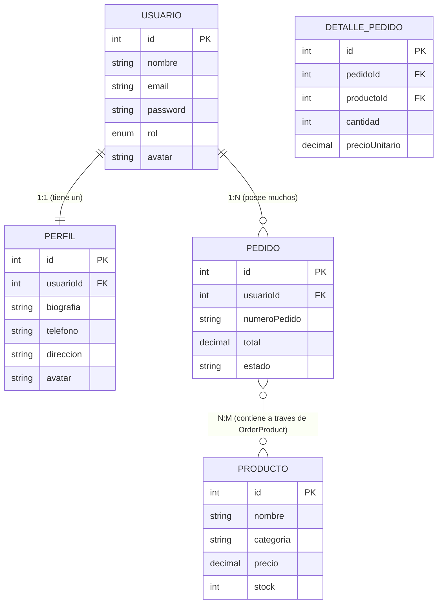

# Reflexiones Técnicas y Decisiones de Diseño — Módulo 8
**Proyecto:** Node & Express Web App (Parte 3: Implementación de API RESTful, JWT, Multer y Relaciones ORM)  
**Autor:** Sebastián Sánchez  
**Stack Tecnológico:** Node.js, Express.js, MySQL 8.0, Sequelize ORM, JSON Web Tokens (JWT), Bcrypt.js, Multer, Swagger UI / OpenAPI 3.0, Dotenv, FS  
**Repositorio GitHub:** [https://github.com/SebastianSanchez2023/Proyecto-Node-Express-Web-App](https://github.com/SebastianSanchez2023/Proyecto-Node-Express-Web-App)  

---

## 1. Diseño y Arquitectura de la API RESTful (Lección 1 y 2)

### 1.1. Convenciones REST Aplicadas
Para garantizar una interfaz coherente, escalable y predecible para clientes externos (Front-End, Mobile o microservicios), se implementaron estrictamente las convenciones RESTful:
- **Sustantivos en plural para recursos:** `/api/usuarios`, `/api/pedidos`, `/api/auth`, `/api/upload`.
- **Uso semántico de verbos HTTP:**
  - `GET`: Obtención idempotente y segura de recursos sin mutar el estado.
  - `POST`: Creación de recursos (`/api/usuarios`, `/api/pedidos`, `/api/auth/register`, `/api/auth/login`).
  - `PUT`: Modificación controlada e idempotente de registros preexistentes (`/api/usuarios/:id`, `/api/pedidos/:id/estado`).
  - `DELETE`: Eliminación lógica o física validando existencia previa (`/api/usuarios/:id`, `/api/pedidos/:id`).
- **Formato de respuesta unificado y consistente:**
  Toda respuesta emitida por el backend respeta la estructura:
  ```json
  {
    "status": "success | error",
    "message": "Descripción clara del resultado de la operación.",
    "data": { ... }
  }
  ```
- **Códigos de estado HTTP rigurosos:** `200 OK`, `201 Created`, `400 Bad Request`, `401 Unauthorized`, `403 Forbidden`, `404 Not Found`, `409 Conflict`, `500 Internal Server Error`.

### 1.2. Justificación: ¿Cómo decidiste separar tus rutas y controladores?
Se adoptó el patrón de **Arquitectura en Capas (Layered Architecture)**, separando responsabilidades de forma desacoplada:
1. **`routes/` (Capa de Enrutamiento):** Su única función es definir los endpoints, métodos HTTP y asociar middlewares (tales como `verifyJWT`, `authorizeRole` o `handleUpload`) antes de delegar la ejecución. No contiene lógica de negocio ni manipulación de base de datos.
2. **`controllers/` (Capa de Controladores):** Gestiona el ciclo HTTP (extrae parámetros de `req.params`, `req.query`, `req.body`, `req.file`), orquesta las llamadas a la capa de servicios, captura excepciones con bloques `try/catch` y formatea la respuesta JSON estandarizada con su respectivo código de estado.
3. **`services/` (Capa de Negocio):** Centraliza la lógica de negocio pura, las reglas de validación complejas, las llamadas al ORM (`User.findAll()`, `Order.create()`) y la gestión de transacciones atómicas ACID. Esto permite reutilizar servicios en múltiples controladores o scripts sin depender del objeto `res` de Express.
4. **`middlewares/` (Capa de Interceptación):** Funciones reutilizables que validan precondiciones de seguridad (autenticación JWT, verificación de roles RBAC, registro de logs de acceso HTTP, control de errores de Multer).

### 1.3. Justificación: ¿Qué validaciones realizaste antes de insertar/modificar datos?
Para evitar inconsistencias, colisiones e inyecciones de datos no deseadas (*Mass Assignment Vulnerability*):
1. **Validación de Parámetros Obligatorios:** En controladores y servicios se verifica la presencia de datos críticos (`email`, `password`, `nombre`) antes de invocar al motor de base de datos.
2. **Unicidad de Registros:** Verificación previa mediante `User.findOne({ where: { email } })` para emitir un error semántico `409 Conflict` si el correo ya está en uso.
3. **Lista Blanca (Whitelist) en Modificaciones (`PUT`):** En `updateUser`, solo se permite mutar campos explícitamente autorizados (`nombre`, `rol`, `estado`, `avatar`). Se descartan de forma estricta campos críticos como `id`, `email` o fechas de auditoría para evitar sobreescritura maliciosa.
4. **Validaciones Nativas en Modelos Sequelize:** Validadores declarativos como `isEmail: true`, `notEmpty: true`, `len: [2, 100]` y restricciones `min: 0.01` en valores decimales.

---

## 2. Securización mediante JSON Web Tokens (JWT) y Bcrypt (Lección 4)

### 2.1. Criptografía y Protección de Credenciales
- **Hashing Unidireccional con Sal (Bcrypt.js):** Las contraseñas jamás se almacenan en texto plano. Se implementaron hooks de Sequelize (`beforeCreate`, `beforeUpdate`) que generan automáticamente un salt de 10 rondas y hashean la clave antes de cualquier persistencia física en MySQL.
- **Exclusión Automática (Default Scope):** El modelo `User` tiene configurado un `defaultScope` que excluye el campo `password` de cualquier consulta estándar, evitando fugas involuntarias en respuestas HTTP JSON.

### 2.2. Flujo de Emisión y Validación de JWT
1. **Generación (`POST /api/auth/login`):** Tras verificar exitosamente la contraseña con `user.validPassword(passwordPlain)`, el servidor firma un token JWT utilizando el algoritmo `HS256`, una clave privada definida en `process.env.JWT_SECRET` y un periodo de validez de 2 horas (`process.env.JWT_EXPIRES_IN`).
2. **Payload Seguro:** Solo contiene claims de identificación necesarios (`id`, `nombre`, `email`, `rol`). Jamás se incluye la contraseña ni datos confidenciales.
3. **Middleware de Validación (`verifyJWT`):** Intercepta la cabecera `Authorization: Bearer <token>`.
   - Si no se provee el token: responde de forma inmediata `401 Unauthorized`.
   - Si el token ha superado su vigencia: captura `TokenExpiredError` y responde `401 Unauthorized` indicando la expiración de la sesión.
   - Si la firma fue manipulada o el formato es corrupto: captura `JsonWebTokenError` y responde `403 Forbidden`.
   - Si es válido: decodifica el payload y lo inyecta en `req.user` para su posterior uso en la cadena de ejecución.

### 2.3. Justificación: ¿Por qué decidiste proteger esas rutas?
Se definieron rutas públicas y privadas basándose en el principio de mínimo privilegio:
- **Rutas Públicas:** 
  - `POST /api/auth/login` y `POST /api/auth/register`: Necesarias para el ingreso inicial de usuarios no autenticados.
  - `GET /`, `GET /status`, `GET /logs`, `GET /api/usuarios`: Permiten consulta y monitorización básica del sistema.
- **Rutas Protegidas:**
  - `GET /api/auth/perfil`: Información íntima y sensible del usuario activo (perfil, pedidos y datos privados).
  - `PUT /api/usuarios/:id` y `DELETE /api/usuarios/:id`: Acciones destructivas o modificadoras que exigen certificar fehacientemente la identidad del actor. En el caso del borrado, se añade el middleware `authorizeRole('admin')`.
  - `POST /api/pedidos` y `PUT /api/pedidos/:id/estado`: Generación de órdenes comerciales con impacto transaccional y financiero.
  - `POST /api/usuarios/:id/avatar` y `POST /api/upload/avatar`: Mutación de registros con archivos binarios en el servidor.

### 2.4. Justificación: ¿Dónde y cómo almacenas el token?
- **En Clientes Web (Front-End SPA):** En la interfaz gráfica interactiva (`public/js/app.js`), el token se almacena en memoria durante la sesión y en `localStorage` del navegador para persistencia entre recargas del dashboard. Al realizar peticiones `fetch()`, se envía en la cabecera estándar `Authorization: Bearer ${token}`.
- **Recomendación para Producción:** En entornos comerciales de alta exigencia, se aconseja almacenar los tokens en cookies seguras con directivas `HttpOnly`, `Secure` y `SameSite=Strict` para mitigar al 100% ataques de tipo Cross-Site Scripting (XSS).

---

## 3. Subida de Archivos al Servidor con Multer (Lección 3)

### 3.1. Configuración de Multer y Almacenamiento Seguro
- **Destino Organizado (`uploads/`):** Los archivos se almacenan en el directorio local `/uploads`, creado automáticamente si no existe y servido estáticamente por Express mediante `app.use('/uploads', express.static(...))`.
- **Estrategia Anticolisión de Nombres:** Se sanea el nombre original (eliminando caracteres especiales) y se concatena con la marca temporal `Date.now()` y un número pseudoaleatorio criptográfico (`Math.round(Math.random() * 1e9)`). Esto previene sobreescrituras accidentales entre usuarios con archivos de igual nombre.
- **Control de Formatos y Seguridad (MIME Type Filter):** Solo se admiten archivos seguros (`image/jpeg`, `image/png`, `image/webp`, `image/gif`, `application/pdf`). Cualquier intento de subir ejecutables (`.exe`, `.sh`, `.bat`) es rechazado con error `400 Bad Request`.
- **Control de Tamaño (File Size Limit):** Límite configurado en **5 Megabytes**. Exceder este umbral dispara el manejador de `MulterError: LIMIT_FILE_SIZE` retornando un error controlado.

### 3.2. Tarea PLUS: Asociación con Registro en Base de Datos
En el endpoint `POST /api/usuarios/:id/avatar`:
1. Multer procesa y valida la imagen física en disco.
2. El controlador extrae el ID del usuario objetivo.
3. Se actualiza de manera transaccional el campo `avatar` en la tabla `usuarios` y en la tabla `perfiles` (relación 1:1).
4. Se registra el evento en el archivo plano de auditoría `logs/uploads.log`.
5. Se responde con la URL pública generada (`/uploads/[nombre-unico].png`), lista para ser consumida directamente desde cualquier navegador o cliente web.

---

## 4. Modelado y Relaciones ORM: 1:1, 1:N y N:M (Requerimientos Generales)

El proyecto cumple exhaustivamente con la totalidad de relaciones exigidas por la consigna:



1. **Relación 1:1 (Usuario &harr; Perfil):**
   ```javascript
   User.hasOne(Profile, { foreignKey: 'usuarioId', as: 'perfil', onDelete: 'CASCADE' });
   Profile.belongsTo(User, { foreignKey: 'usuarioId', as: 'usuario' });
   ```
2. **Relación 1:N (Usuario &harr; Pedidos):**
   ```javascript
   User.hasMany(Order, { foreignKey: 'usuarioId', as: 'pedidos', onDelete: 'CASCADE' });
   Order.belongsTo(User, { foreignKey: 'usuarioId', as: 'usuario' });
   ```
3. **Relación N:M (Pedido &harr; Productos a través de tabla intermedia):**
   ```javascript
   Order.belongsToMany(Product, { through: OrderProduct, as: 'productos', foreignKey: 'pedidoId' });
   Product.belongsToMany(Order, { through: OrderProduct, as: 'pedidos', foreignKey: 'productoId' });
   ```
4. **Eager Loading Anidado:** En `GET /api/usuarios/relaciones`, Sequelize ejecuta una única consulta con `LEFT OUTER JOIN` optimizados, trayendo al usuario junto a su perfil (1:1), sus pedidos (1:N) y los productos comprados en cada orden (N:M).

---

## 5. Tarea PLUS: Documentación Interactiva Swagger / OpenAPI 3.0

Se integró **Swagger UI** accesible directamente en la ruta:
👉 `http://localhost:3001/api-docs`

- **Especificación OpenAPI 3.0 Completa:** Documenta esquemas, parámetros de consulta, cuerpos JSON, códigos de error y respuestas de éxito para todos los módulos.
- **Soporte de Autenticación Integrado:** Incluye la configuración del componente de seguridad `bearerAuth`. Permite ingresar el token JWT generado en el botón `Authorize 🔓` para probar endpoints protegidos directamente desde el navegador web.

---

## 6. Persistencia en Archivos Planos y Auditoría

Cumpliendo con la directiva de persistencia en archivos planos para operaciones auxiliares:
1. `logs/log.txt`: Registro cronológico de cada solicitud HTTP que ingresa al servidor (Módulo 6).
2. `logs/transactions_errors.log`: Registro forense de transacciones ACID abortadas con rollback (Módulo 7).
3. `logs/auth_audit.log`: Trazabilidad de accesos (logins exitosos, logins fallidos con contraseñas erróneas, registros de usuarios).
4. `logs/uploads.log`: Historial de subida de archivos (nombre original, nombre sanitizado, tamaño en KB, tipo MIME y usuario asociado).

---

## 7. Reflexión de Cierre: Integración de los 3 Módulos del Programa

El desarrollo de este proyecto integrador representó una evolución profesional completa y progresiva en la disciplina del Backend:

- **Módulo 6 (Fundamentos del Servidor):** Permitió asentar las bases del ciclo de vida de una petición HTTP, el diseño de middlewares globales, el enrutamiento modular con Express y el valor de la persistencia liviana en archivos planos.
- **Módulo 7 (Acceso a Datos y ORM):** Transformó la aplicación en un backend persistente real, integrando el motor relacional MySQL mediante Sequelize. Se comprendió la ventaja radical de utilizar un ORM para abstraer la sintaxis SQL, la importancia de garantizar la consistencia atómica mediante transacciones ACID (con soporte de Rollback) y el poder de modelar relaciones complejas con Eager Loading.
- **Módulo 8 (API RESTful, Seguridad y Archivos):** Consolidó todas las piezas en un producto backend de nivel empresarial. La incorporación de autenticación criptográfica con JWT y Bcrypt dotó de seguridad real al ecosistema; la integración de Multer resolvió la gestión de binarios y subida de archivos en disco vinculados al motor relacional; y finalmente, la documentación formal con Swagger/OpenAPI y la colección automatizada de Postman dejaron a la aplicación lista para ser consumida de inmediato por cualquier cliente web o móvil.

El resultado es un sistema robusto, testeado, desacoplado y preparado para entornos productivos reales.
